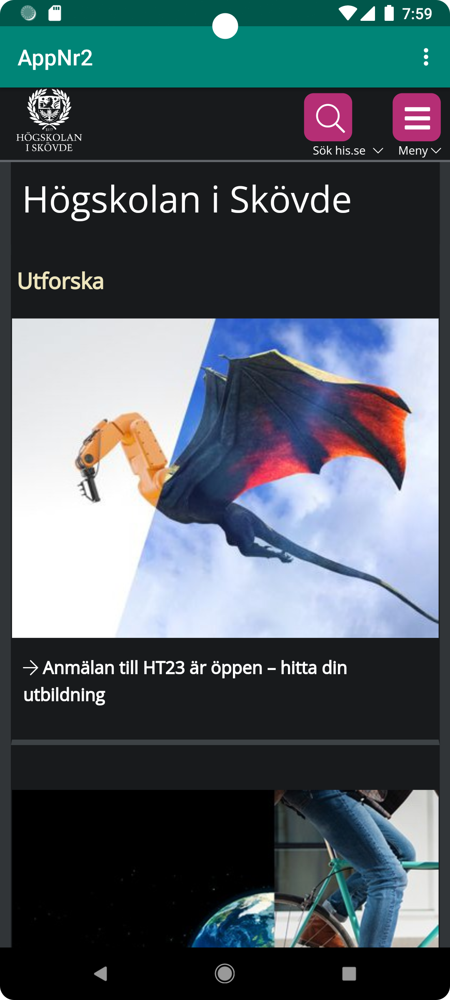
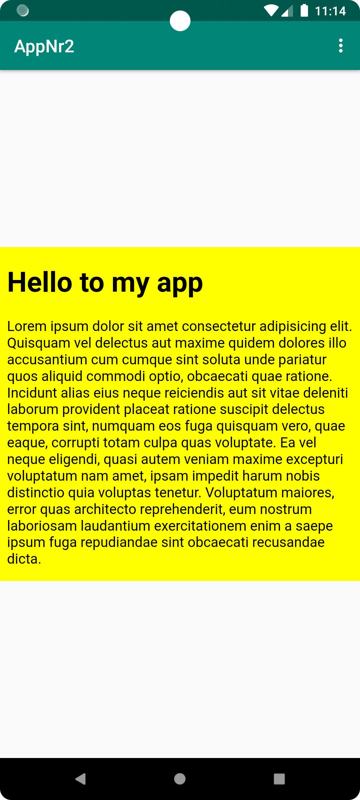

# Rapport

Började med att göra så att kan man få internet access till appen. Detta gjordes med hjälp av
koden under:
```
<uses-permission android:name="android.permission.INTERNET" />
```

Efter det byte jag ut "TextView" till "WebView" och la till en rad kod så att Webview har en id
i sig. Koden under är då koden för webview samt dess id som webview får och id:en är "webview".
```
<WebView
    android:id="@+id/webview"
    (...)/>
```

Därefter kallade jag id i scriptet "MainActivity.java".  Detta gjorde med hjälp av att börja med
att göra en variabel som heter myWebView med data typen WebView. Därefter skapade jag en 
WebViewClient med hjälp av variabeln myWebView. Efter det gjordes det så att javascript var
"Enable", alltså att man kan anvädna sig av javasript när man gör för exempel en webbsida i 
sin app. Detta gjordes med koden under:

```
myWebView = findViewById(R.id.webview);
myWebView.setWebViewClient(new WebViewClient());
myWebView.getSettings().setJavaScriptEnabled(true);
```

Som sist gjorde så att internal page och external page fungerade. Det först gjordes så att external
page fungerade med hjälp av att använda sig av "loadUrl()", i external page användes det his.se som
url. I internal page gjordes med hjälp av att använda sig av en html fil. Koden såg ut på detta 
sätt för att använda sig av loadUrl():

```
public void showExternalWebPage(){
    myWebView.loadUrl("https://his.se");
}

public void showInternalWebPage(){
    myWebView.loadUrl("file:///android_asset/about.html");
}
```

Hur man kallar på dessa funktioner är genom en if sats. När man klickar på external page i appen så
kommer man till his.se och när man klickar på internal page kommer man ta sig till html filen.
Under är både koden för if satserna och bilderna på external page och internal page.

```
if (id == R.id.action_external_web) {
    Log.d("==>","Will display external web page");
    showExternalWebPage();
    return true;
}

if (id == R.id.action_internal_web) {
    Log.d("==>","Will display internal web page");
    showInternalWebPage();
    return true;
}
```



